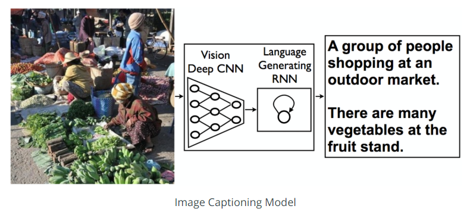

# Image-Captioning
## Project Overview
This project is part of Udacity Computer Vision Nanodegree. It is a neural network architecture that automatically generate captions from images.
It is a compination of a deep NN for features extraction, and a RNN for Captions generation as illustrated in the image below.

The dataset used for training is the Microsoft Common Objects in COntext (MS COCO)

## Project Structure
The project is structured as a series of Jupyter notebooks that are designed to be completed in sequential order:

0-Dataset.ipynb

1-Preliminaries.ipynb

2-Training.ipynb

3-Inference.ipynb

## Examples (images with predicted captions)

